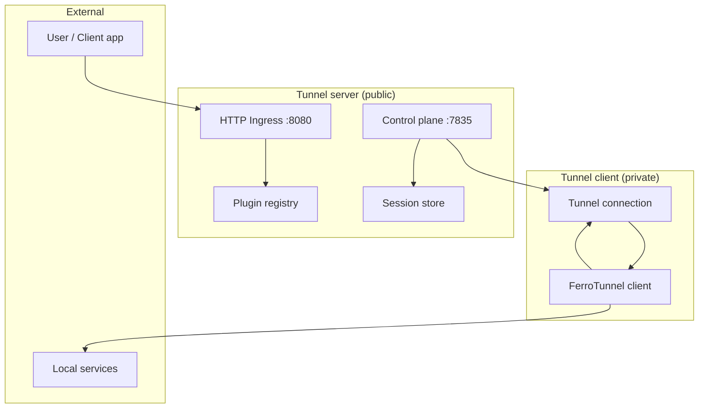
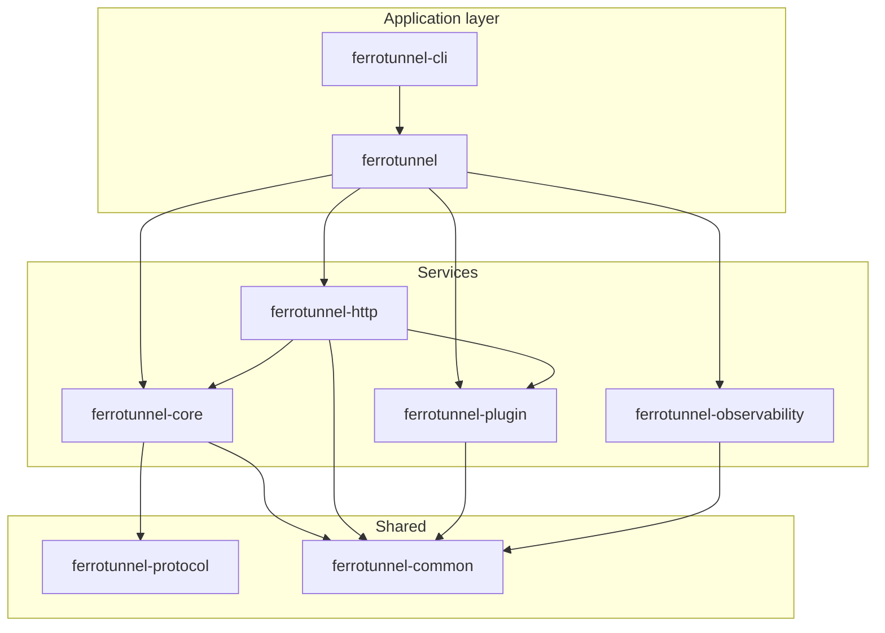
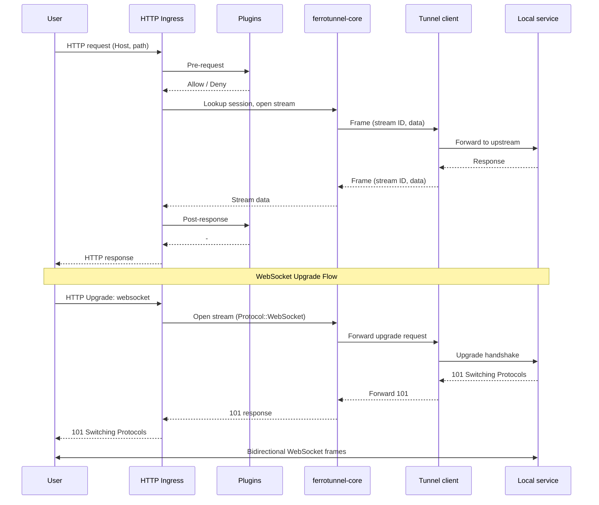
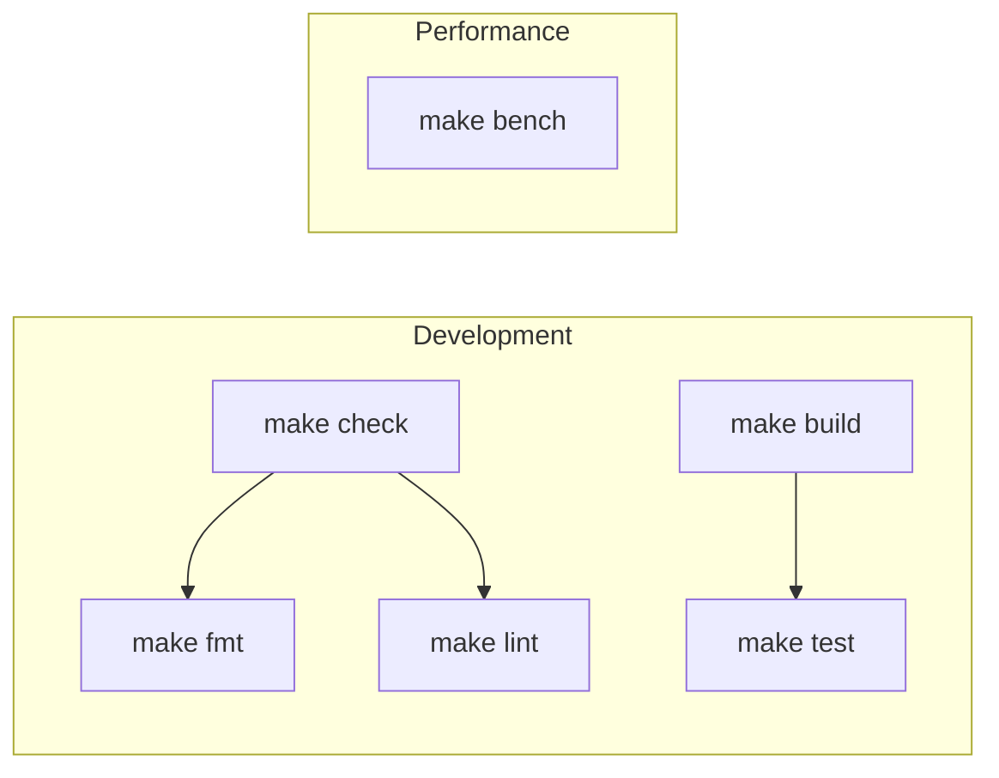

# FerroTunnel Architecture

## High-level overview



## Project Structure

FerroTunnel uses a **tokio-style workspace** the standard pattern for multi-crate Rust projects.

```
ferrotunnel/
├── Cargo.toml
├── Makefile
├── README.md
├── CHANGELOG.md
├── ROADMAP.md
├── AGENTS.md
├── Dockerfile
├── docker-compose.yml
├── .github/
│   ├── dependabot.yml
│   └── workflows/
│       ├── ci.yml
│       ├── codeql.yml
│       ├── nightly-fuzz.yml
│       └── release-assets.yml
├── docs/
│   ├── ARCHITECTURE.md
│   ├── benchmark.md
│   ├── deployment.md
│   ├── security.md
│   └── static/
├── ferrotunnel/
│   ├── Cargo.toml
│   ├── README.md
│   └── src/
│       ├── lib.rs
│       ├── client.rs
│       ├── server.rs
│       └── config.rs
├── ferrotunnel-core/
│   ├── Cargo.toml
│   ├── README.md
│   ├── src/
│   │   ├── lib.rs
│   │   ├── auth.rs
│   │   ├── rate_limit.rs
│   │   ├── reconnect.rs
│   │   ├── resource_limits.rs
│   │   ├── tunnel/
│   │   │   ├── mod.rs
│   │   │   ├── client.rs
│   │   │   ├── server.rs
│   │   │   └── session.rs
│   │   ├── stream/
│   │   │   ├── mod.rs
│   │   │   ├── multiplexer.rs
│   │   │   ├── quic_multiplexer.rs  # (feature: quic)
│   │   │   ├── pool.rs
│   │   │   └── bytes_pool.rs
│   │   └── transport/
│   │       ├── mod.rs
│   │       ├── tcp.rs
│   │       ├── tls.rs
│   │       ├── quic.rs              # (feature: quic)
│   │       ├── batched_sender.rs
│   │       └── socket_tuning.rs
│   └── benches/
│       ├── batched_sender.rs
│       ├── multiplexer.rs
│       └── transport.rs
├── ferrotunnel-http/
│   ├── Cargo.toml
│   ├── README.md
│   └── src/
│       ├── lib.rs
│       ├── ingress.rs
│       ├── proxy.rs
│       └── tcp_ingress.rs
├── ferrotunnel-protocol/
│   ├── Cargo.toml
│   ├── README.md
│   ├── src/
│   │   ├── lib.rs
│   │   ├── frame.rs
│   │   ├── codec.rs
│   │   ├── constants.rs
│   │   └── validation.rs
│   ├── benches/
│   │   └── codec.rs
│   └── fuzz/
│       ├── Cargo.toml
│       └── fuzz_targets/
│           ├── codec_decode.rs
│           └── frame_validation.rs
├── ferrotunnel-plugin/
│   ├── Cargo.toml
│   ├── README.md
│   └── src/
│       ├── lib.rs
│       ├── traits.rs
│       ├── registry.rs
│       └── builtin/
│           ├── mod.rs
│           ├── auth.rs
│           ├── logger.rs
│           ├── rate_limit.rs
│           └── circuit_breaker.rs
├── ferrotunnel-observability/
│   ├── Cargo.toml
│   ├── README.md
│   └── src/
│       ├── lib.rs
│       ├── metrics.rs
│       ├── tracing.rs
│       └── dashboard/
│           ├── mod.rs
│           ├── events.rs
│           ├── handlers.rs
│           ├── models.rs
│           └── static/
│               ├── index.html
│               ├── app.js
│               ├── style.css
│               └── ss.png
├── ferrotunnel-common/
│   ├── Cargo.toml
│   ├── README.md
│   └── src/
│       ├── lib.rs
│       ├── error.rs
│       └── config.rs
├── ferrotunnel-cli/
│   ├── Cargo.toml
│   ├── README.md
│   └── src/
│       ├── main.rs
│       ├── middleware.rs
│       └── commands/
│           ├── mod.rs
│           ├── client.rs
│           ├── server.rs
│           └── version.rs
├── tests/
│   ├── Cargo.toml
│   ├── lib.rs
│   └── integration/
│       ├── mod.rs
│       ├── tunnel_test.rs
│       ├── plugin_test.rs
│       ├── tls_test.rs
│       ├── tcp_test.rs
│       ├── websocket_test.rs
│       ├── quic_test.rs          # (feature: quic)
│       ├── concurrent_test.rs
│       ├── multi_client_test.rs
│       └── error_test.rs
├── benches/
│   ├── Cargo.toml
│   ├── lib.rs
│   ├── e2e_tunnel.rs
│   ├── full_stack.rs
│   ├── throughput.rs
│   ├── tcp_throughput.rs
│   └── latency.rs
├── tools/
│   ├── loadgen/
│   │   ├── Cargo.toml
│   │   └── src/main.rs
│   ├── soak/
│   │   ├── Cargo.toml
│   │   └── src/main.rs
│   └── profiler/
│       ├── profile-codec.sh
│       ├── profile-memory.sh
│       └── profile-server.sh
└── scripts/
    ├── benchmark.sh
    ├── publish.sh
    ├── test-examples.sh
    ├── test-tunnel.sh
    ├── test-dashboard.sh
    ├── test-docker.sh
    ├── test-plugins.sh
    └── yank-all.sh
```

## Crates



| Crate | Purpose |
|-------|---------|
| `ferrotunnel` | Main API: `Client::builder()`, `Server::builder()`, re-exports, prelude |
| `ferrotunnel-core` | Tunnel engine: connection, session, multiplexer, transport (TCP/TLS) |
| `ferrotunnel-http` | Ingress, HTTP/WebSocket proxy, TCP ingress |
| `ferrotunnel-protocol` | Frame types, codec, validation |
| `ferrotunnel-plugin` | Plugin traits, registry, builtins (auth, logger, rate_limit, circuit_breaker) |
| `ferrotunnel-observability` | Metrics, tracing, dashboard (Axum + SSE + Web UI) |
| `ferrotunnel-common` | Error types, `Result<T>`, shared config |
| `ferrotunnel-cli` | `ferrotunnel` binary: `server`, `client`, `version` subcommands |

## Request path (data flow)



## Integration Tests

| File | Coverage |
|------|----------|
| `tunnel_test.rs` | Server startup, client connection, HTTP proxying |
| `plugin_test.rs` | Auth, rate limiting, execution order |
| `tls_test.rs` | TLS end-to-end |
| `tcp_test.rs` | TCP tunnel echo |
| `websocket_test.rs` | WebSocket upgrade through tunnel, 101 handshake |
| `concurrent_test.rs` | Concurrent requests |
| `multi_client_test.rs` | Multiple clients, reconnection |
| `error_test.rs` | Timeout, connection refused |

```bash
cargo test -p ferrotunnel-tests --test integration
```

## Examples

Ready-to-run examples are maintained in the [tunnel-examples repository](https://github.com/ferro-labs/tunnel-examples) so their dependency versions and deployment instructions can evolve independently.

## Benchmarks

| Benchmark | Purpose |
|-----------|---------|
| `e2e_tunnel` | Full stack |
| `full_stack` | End-to-end |
| `throughput` | Raw data transfer |
| `tcp_throughput` | TCP tunnel |
| `latency` | Latency percentiles |

```bash
cargo bench -p ferrotunnel-benches
./scripts/benchmark.sh save          # Save baseline
./scripts/benchmark.sh main full_stack,tcp_throughput  # Compare
```

## Commands



```bash
make build      # cargo build --workspace
make test       # cargo test --workspace --all-features
make check      # fmt + clippy
make fmt        # cargo fmt --all
make lint       # cargo clippy --workspace --all-targets --all-features -- -D warnings
make bench      # cargo bench --workspace
make all        # fmt, check, test, build
```

## References

- [Cargo Workspaces](https://doc.rust-lang.org/cargo/reference/workspaces.html)
- [Tokio](https://github.com/tokio-rs/tokio)
